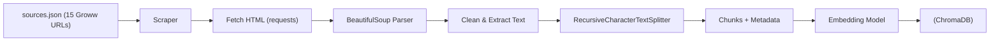
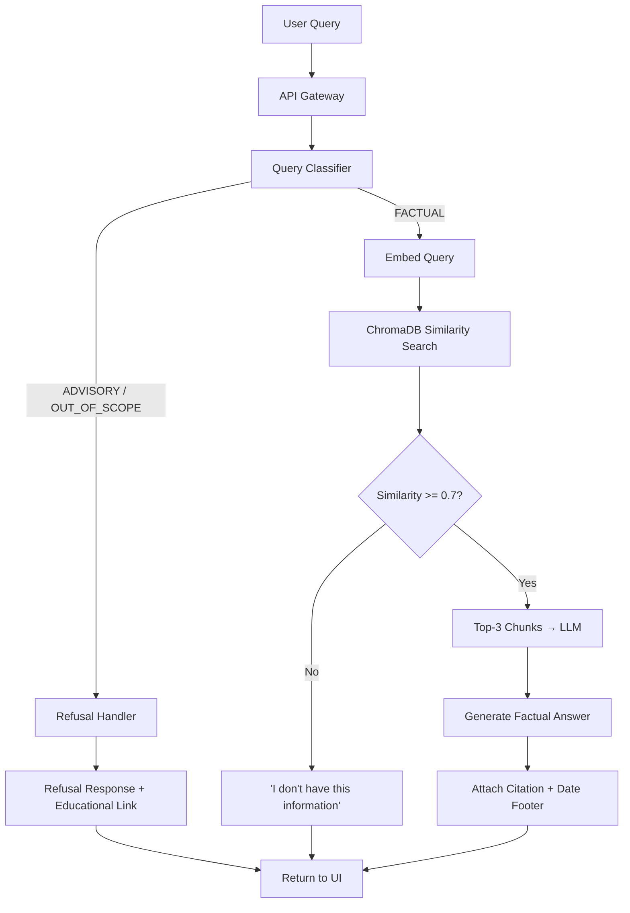

# Architecture — Mutual Fund FAQ Assistant (RAG-Based)

## 1. System Architecture Overview

```
┌─────────────────────────────────────────────────────────────────────────────────┐
│                              USER INTERFACE LAYER                               │
│  ┌───────────────────────────────────────────────────────────────────────────┐  │
│  │  Chat UI (HTML/CSS/JS)                                                    │  │
│  │  • Welcome message + 3 example questions                                  │  │
│  │  • Chat input + response display                                          │  │
│  │  • Disclaimer footer: "Facts-only. No investment advice."                 │  │
│  └──────────────────────────────┬────────────────────────────────────────────┘  │
└─────────────────────────────────┼───────────────────────────────────────────────┘
                                  │ HTTP (REST API)
┌─────────────────────────────────┼───────────────────────────────────────────────┐
│                          APPLICATION LAYER (Backend)                             │
│                                  │                                               │
│  ┌──────────────────────────────▼────────────────────────────────────────────┐  │
│  │                        API Gateway (FastAPI)                               │  │
│  │  POST /api/chat  — handles user query                                     │  │
│  │  GET  /api/health — health check                                          │  │
│  └──────┬───────────────────────────────────────────────────┬────────────────┘  │
│         │                                                   │                    │
│  ┌──────▼──────────────┐                          ┌─────────▼──────────────┐    │
│  │  Query Classifier    │                          │  Refusal Handler       │    │
│  │  (Intent Detection)  │─── advisory/opinion ────▶│  • Polite refusal msg  │    │
│  │  • Factual query?    │                          │  • Educational link    │    │
│  │  • Advisory query?   │                          │  (AMFI/SEBI resource)  │    │
│  │  • Out-of-scope?     │                          └────────────────────────┘    │
│  └──────┬───────────────┘                                                        │
│         │ factual                                                                │
│  ┌──────▼──────────────────────────────────────────────────────────────────┐     │
│  │                         RAG PIPELINE                                     │     │
│  │                                                                          │     │
│  │  ┌─────────────┐    ┌──────────────┐    ┌────────────────────────────┐  │     │
│  │  │ Query        │    │ Retriever     │    │ Response Generator        │  │     │
│  │  │ Embedding    │───▶│ (Similarity   │───▶│ (LLM with system prompt) │  │     │
│  │  │ (same model  │    │  Search)      │    │ • Max 3 sentences        │  │     │
│  │  │  as corpus)  │    │ • Top-k = 5   │    │ • 1 citation link        │  │     │
│  │  └─────────────┘    │ • Reranking   │    │ • Date footer            │  │     │
│  │                      └──────┬───────┘    └────────────┬───────────────┘  │     │
│  │                             │                         │                  │     │
│  │                      ┌──────▼───────┐          ┌──────▼───────────┐     │     │
│  │                      │ Vector Store  │          │ Prompt Template  │     │     │
│  │                      │ (ChromaDB)    │          │ (System + User   │     │     │
│  │                      │              │          │  + Context)      │     │     │
│  │                      └──────────────┘          └──────────────────┘     │     │
│  └──────────────────────────────────────────────────────────────────────────┘     │
└──────────────────────────────────────────────────────────────────────────────────┘
                                  │
┌─────────────────────────────────┼───────────────────────────────────────────────┐
│                           DATA LAYER                                             │
│                                  │                                               │
│  ┌──────────────────────────────▼────────────────────────────────────────────┐  │
│  │                     Document Ingestion Pipeline                            │  │
│  │                                                                            │  │
│  │  ┌────────────┐   ┌──────────────┐   ┌────────────┐   ┌───────────────┐  │  │
│  │  │ URL Scraper │──▶│ Text Extractor│──▶│ Chunker    │──▶│ Embedder +    │  │  │
│  │  │ (requests + │   │ (PDF, HTML)   │   │ (recursive │   │ Vector Store  │  │  │
│  │  │  BS4)       │   │              │   │  splitter)  │   │ Indexer       │  │  │
│  │  └────────────┘   └──────────────┘   └────────────┘   └───────────────┘  │  │
│  └────────────────────────────────────────────────────────────────────────────┘  │
│                                                                                  │
│  ┌────────────────────────────────────────────────────────────────────────────┐  │
│  │  Source Metadata Store                                                      │  │
│  │  • URL → source_name mapping                                               │  │
│  │  • Last scraped date per source                                            │  │
│  │  • Document → chunk mapping                                                │  │
│  └────────────────────────────────────────────────────────────────────────────┘  │
└──────────────────────────────────────────────────────────────────────────────────┘
```

---

## 2. Component Breakdown

### 2.1 UI Layer — Chat Interface

| Aspect | Detail |
|---|---|
| **Technology** | HTML + CSS + Vanilla JavaScript |
| **Design** | Minimal chat interface — dark/light mode, clean typography |
| **Elements** | Welcome message, 3 example query buttons, chat input, response cards with citation + date, disclaimer banner |
| **Communication** | Sends POST requests to `/api/chat` with `{ "query": "..." }` |
| **Responsiveness** | Mobile-first, works on all screen sizes |

**UI State Machine:**

```
┌──────────┐   user types    ┌──────────┐   API response   ┌──────────────┐
│  IDLE     │───────────────▶│  LOADING  │────────────────▶│  DISPLAYING   │
│  (ready)  │                │  (spinner)│                  │  (response)   │
└──────────┘                 └──────────┘                  └──────┬────────┘
      ▲                                                          │
      └──────────────────────────────────────────────────────────┘
                              user types again
```

---

### 2.2 API Layer — FastAPI Backend

#### Endpoints

| Method | Endpoint | Description | Request Body | Response |
|---|---|---|---|---|
| `POST` | `/api/chat` | Process a user query | `{ "query": "string" }` | `{ "answer": "...", "citation": "...", "last_updated": "...", "type": "factual\|refusal" }` |
| `GET` | `/api/health` | Health check | — | `{ "status": "ok" }` |

#### Response Schema

```json
{
  "answer": "The expense ratio of SBI Bluechip Fund (Direct) is 0.82% as of June 2026.",
  "citation": {
    "url": "https://www.sbimf.com/en-us/equity-schemes/sbi-blue-chip-fund",
    "title": "SBI Bluechip Fund — Factsheet"
  },
  "last_updated": "2026-07-01",
  "type": "factual"
}
```

#### Refusal Response Schema

```json
{
  "answer": "I can only provide factual information about mutual fund schemes. For investment guidance, please consult a SEBI-registered advisor.",
  "citation": {
    "url": "https://www.amfiindia.com/investor-corner/knowledge-center/what-are-mutual-funds.html",
    "title": "AMFI — What Are Mutual Funds?"
  },
  "last_updated": null,
  "type": "refusal"
}
```

---

### 2.3 Query Classifier — Intent Detection

The classifier determines whether a user query is **factual**, **advisory**, or **out-of-scope** before routing it through the pipeline.

```
                     ┌──────────────────┐
                     │   User Query      │
                     └────────┬─────────┘
                              │
                     ┌────────▼─────────┐
                     │  LLM Classifier   │
                     │  (system prompt   │
                     │   based)          │
                     └────────┬─────────┘
                              │
              ┌───────────────┼───────────────┐
              │               │               │
     ┌────────▼───┐  ┌───────▼──────┐  ┌─────▼──────────┐
     │  FACTUAL    │  │  ADVISORY    │  │  OUT_OF_SCOPE   │
     │             │  │              │  │                 │
     │ → RAG       │  │ → Refusal    │  │ → Refusal       │
     │   Pipeline  │  │   Handler    │  │   Handler       │
     └─────────────┘  └──────────────┘  └─────────────────┘
```

**Classification Strategy:**

| Category | Signals | Action |
|---|---|---|
| **Factual** | "What is", "How to", "expense ratio", "exit load", "SIP amount", "lock-in", "benchmark" | Proceed to RAG pipeline |
| **Advisory** | "Should I", "recommend", "better fund", "which is best", "worth investing" | Polite refusal + educational link |
| **Out-of-Scope** | Queries about stocks, crypto, banking, unrelated topics | Polite refusal stating scope limitation |

**Implementation:** Use an LLM-based classifier with a carefully crafted system prompt. The classification happens in a single LLM call before the RAG retrieval step, keeping latency low.

---

### 2.4 RAG Pipeline — Core Retrieval & Generation

#### Step-by-Step Flow

```
1. QUERY EMBEDDING
   User query → Embedding model → Query vector (384/768/1536 dims)

2. SIMILARITY SEARCH
   Query vector → ChromaDB → Top-k (k=5) most similar chunks
   Each chunk carries metadata: { source_url, source_title, scraped_date, chunk_id }

3. CONTEXT ASSEMBLY
   Top-k chunks → Reranked by relevance → Top 3 selected
   Assembled into a context block for the LLM

4. PROMPT CONSTRUCTION
   System prompt + Context block + User query → Full prompt

5. LLM GENERATION
   Full prompt → LLM → Constrained response (≤3 sentences + 1 citation + date)

6. POST-PROCESSING
   Extract citation URL from metadata of most relevant chunk
   Append "Last updated from sources: <date>" footer
   Validate response structure
```

#### Retrieval Strategy

| Parameter | Value | Rationale |
|---|---|---|
| **Top-k retrieval** | 5 | Broad initial retrieval to capture relevant context |
| **Reranking** | Top 3 after rerank | Precision-focused for LLM context |
| **Chunk size** | 500 tokens | Balances granularity and context completeness |
| **Chunk overlap** | 50 tokens | Prevents information loss at chunk boundaries |
| **Distance metric** | Cosine similarity | Standard for semantic similarity |
| **Min similarity threshold** | 0.7 | Below this → "I don't have enough information" fallback |

---

### 2.5 Document Ingestion Pipeline

> **Note:** All data is sourced exclusively from **15 Groww scheme pages** (HTML only). There are no PDFs or other document formats.

```
┌────────────────┐    ┌────────────────┐    ┌────────────────┐    ┌────────────────┐
│  1. COLLECT     │    │  2. EXTRACT     │    │  3. CHUNK       │    │  4. EMBED       │
│                │    │                │    │                │    │                │
│ • Read URL list│───▶│ • HTML → text  │───▶│ • Recursive    │───▶│ • Generate     │
│   from config  │    │   (BS4)        │    │   text splitter│    │   embeddings   │
│ • Fetch Groww  │    │ • Clean +      │    │ • 500 tokens   │    │ • Store in     │
│   scheme pages │    │   normalize    │    │ • 50 overlap   │    │   ChromaDB     │
│ • Track dates  │    │ • Extract key  │    │ • Preserve     │    │ • Attach       │
│                │    │   data sections│    │   metadata     │    │   metadata     │
└────────────────┘    └────────────────┘    └────────────────┘    └────────────────┘
```

#### Source URL Configuration (`sources.json`)

```json
{
  "source": "Groww",
  "total_urls": 15,
  "amcs": [
    {
      "name": "Nippon India Mutual Fund",
      "schemes": [
        { "name": "Nippon India Small Cap Fund", "category": "Small Cap", "url": "https://groww.in/mutual-funds/nippon-india-small-cap-fund-direct-growth" },
        { "name": "Nippon India Large Cap Fund", "category": "Large Cap", "url": "https://groww.in/mutual-funds/nippon-india-large-cap-fund-direct-growth" },
        { "name": "Nippon India Multi Cap Fund", "category": "Multi Cap", "url": "https://groww.in/mutual-funds/nippon-india-multi-cap-fund-direct-growth" }
      ]
    },
    {
      "name": "Motilal Oswal Mutual Fund",
      "schemes": [
        { "name": "Motilal Oswal Midcap 30 Fund", "category": "Mid Cap", "url": "https://groww.in/mutual-funds/motilal-oswal-most-focused-midcap-30-fund-direct-growth" },
        { "name": "Motilal Oswal Long Term Fund", "category": "ELSS", "url": "https://groww.in/mutual-funds/motilal-oswal-most-focused-long-term-fund-direct-growth" },
        { "name": "Motilal Oswal Multicap 35 Fund", "category": "Multi Cap", "url": "https://groww.in/mutual-funds/motilal-oswal-most-focused-multicap-35-fund-direct-growth" }
      ]
    },
    {
      "name": "Mirae Asset Mutual Fund",
      "schemes": [
        { "name": "Mirae Asset Large & Midcap Fund", "category": "Large & Mid Cap", "url": "https://groww.in/mutual-funds/mirae-asset-large-midcap-fund-direct-growth" },
        { "name": "Mirae Asset Flexi Cap Fund", "category": "Flexi Cap", "url": "https://groww.in/mutual-funds/mirae-asset-flexi-cap-fund-direct-growth" },
        { "name": "Mirae Asset Healthcare Fund", "category": "Sectoral", "url": "https://groww.in/mutual-funds/mirae-asset-healthcare-fund-direct-growth" }
      ]
    },
    {
      "name": "Aditya Birla Sun Life Mutual Fund",
      "schemes": [
        { "name": "ABSL Gold Fund", "category": "Gold", "url": "https://groww.in/mutual-funds/aditya-birla-sun-life-gold-fund-direct-growth" },
        { "name": "ABSL Enhanced Arbitrage Fund", "category": "Arbitrage", "url": "https://groww.in/mutual-funds/birla-sun-life-enhanced-arbitrage-fund-direct-growth" },
        { "name": "ABSL Multi-Asset Allocation Fund", "category": "Multi-Asset", "url": "https://groww.in/mutual-funds/aditya-birla-sun-life-multi-asset-allocation-fund-direct-growth" }
      ]
    },
    {
      "name": "ICICI Prudential Mutual Fund",
      "schemes": [
        { "name": "ICICI Pru Silver ETF FoF", "category": "Silver", "url": "https://groww.in/mutual-funds/icici-prudential-silver-etf-fof-direct-growth" },
        { "name": "ICICI Pru Liquid Fund", "category": "Liquid", "url": "https://groww.in/mutual-funds/icici-prudential-liquid-fund-direct-plan-growth" },
        { "name": "ICICI Pru Balanced Advantage Fund", "category": "Balanced", "url": "https://groww.in/mutual-funds/icici-prudential-balanced-direct-growth" }
      ]
    }
  ]
}
```

#### Metadata Per Chunk

```json
{
  "chunk_id": "nippon_india_small_cap_chunk_003",
  "source_url": "https://groww.in/mutual-funds/nippon-india-small-cap-fund-direct-growth",
  "source_title": "Nippon India Small Cap Fund — Groww",
  "scheme_name": "Nippon India Small Cap Fund",
  "category": "Small Cap",
  "amc": "Nippon India Mutual Fund",
  "scraped_date": "2026-07-03",
  "chunk_index": 3,
  "total_chunks": 8
}
```

---

### 2.6 Prompt Engineering

#### System Prompt

```
You are a facts-only mutual fund FAQ assistant. You answer questions about
mutual fund schemes using ONLY the provided context from official sources.

STRICT RULES:
1. Answer in a MAXIMUM of 3 sentences.
2. Use ONLY information present in the provided context.
3. NEVER give investment advice, opinions, or recommendations.
4. NEVER compare fund performances or calculate returns.
5. If the context does not contain the answer, say:
   "I don't have this information in my current sources."
6. ALWAYS cite the source — the citation will be attached separately.

RESPONSE FORMAT:
- Direct, factual answer (1–3 sentences max)
- Do NOT include phrases like "Based on the document" or "According to"
- Use plain, simple language
```

#### Full Prompt Template

```
[SYSTEM PROMPT]

---

CONTEXT (from official sources):
{retrieved_chunks}

---

USER QUESTION: {user_query}

---

Provide a factual answer following the rules above.
```

---

### 2.7 Refusal Handler

```python
# Refusal logic (pseudocode)

EDUCATIONAL_LINKS = {
    "advisory": {
        "url": "https://www.amfiindia.com/investor-corner/knowledge-center",
        "title": "AMFI — Investor Knowledge Center"
    },
    "comparison": {
        "url": "https://www.sebi.gov.in/sebiweb/other/OtherAction.do?doRecognisedFpi=yes&intmId=13",
        "title": "SEBI — Mutual Fund Regulations"
    },
    "out_of_scope": {
        "url": "https://www.amfiindia.com/",
        "title": "AMFI India — Official Website"
    }
}

REFUSAL_TEMPLATES = {
    "advisory": "I can only provide factual information about mutual fund schemes. "
                "For personalized investment advice, please consult a SEBI-registered financial advisor.",
    "comparison": "I'm not able to compare fund performances or calculate returns. "
                  "You can view official performance data on the scheme's factsheet.",
    "out_of_scope": "This question is outside my scope. I can only answer factual queries "
                    "about mutual fund schemes from official AMC, AMFI, and SEBI sources."
}
```

---

## 3. Technology Stack

| Layer | Technology | Rationale |
|---|---|---|
| **Frontend** | HTML + CSS + Vanilla JS | Minimal, no build step, lightweight |
| **Backend** | Python + FastAPI | Async support, fast, great for ML/AI workloads |
| **LLM** | Groq API (`llama-3.3-70b-versatile` / `mixtral-8x7b-32768`) | Ultra-fast inference, high-quality open-source LLMs |
| **Embeddings** | BGE (`BAAI/bge-small-en-v1.5` via sentence-transformers) | High-quality BAAI General Embedding for semantic search |
| **Vector Store** | ChromaDB | Local, lightweight, no infra needed, Python-native |
| **Web Scraping** | `requests` + `BeautifulSoup4` | HTML extraction from Groww scheme pages |
| **Text Splitting** | LangChain `RecursiveCharacterTextSplitter` | Smart chunking with overlap |
| **Environment** | `python-dotenv` | Secure API key management |

> **Note:** No PDF parsing libraries are needed — all 15 data sources are Groww HTML pages.

---

## 4. Project Directory Structure

```
RAG Chatbot/
│
├── context.md                    # Project context document
├── architecture.md               # This file — system architecture
├── Problem statement.txt         # Original problem statement
├── README.md                     # Setup instructions & overview
│
├── backend/
│   ├── main.py                   # FastAPI app entry point
│   ├── config.py                 # Configuration & environment variables
│   ├── requirements.txt          # Python dependencies
│   │
│   ├── api/
│   │   ├── __init__.py
│   │   ├── routes.py             # API route definitions
│   │   └── schemas.py            # Pydantic request/response models
│   │
│   ├── core/
│   │   ├── __init__.py
│   │   ├── classifier.py         # Query intent classifier
│   │   ├── rag_pipeline.py       # RAG retrieval + generation logic
│   │   ├── refusal_handler.py    # Refusal response handler
│   │   └── prompt_templates.py   # System & user prompt templates
│   │
│   ├── ingestion/
│   │   ├── __init__.py
│   │   ├── scraper.py            # URL scraping (Groww HTML pages)
│   │   ├── extractor.py          # Text extraction & cleaning
│   │   ├── chunker.py            # Document chunking logic
│   │   ├── embedder.py           # Embedding generation + vector store indexing
│   │   └── sources.json          # Curated list of official URLs
│   │
│   └── data/
│       └── chroma_db/            # ChromaDB persistent storage
│
├── frontend/
│   ├── index.html                # Main chat interface
│   ├── style.css                 # Styling
│   └── script.js                 # Chat logic + API calls
│
└── scripts/
    ├── ingest.py                 # Run full ingestion pipeline
    └── test_queries.py           # Test with sample queries
```

---

## 5. Data Flow — End-to-End

### 5.1 Ingestion Flow (One-Time / Periodic)



### 5.2 Query Flow (Runtime)



---

## 6. Security & Privacy Architecture

```
┌──────────────────────────────────────────────────────┐
│                   SECURITY BOUNDARIES                 │
│                                                      │
│  ┌─────────────────────────────────────────────────┐ │
│  │  INPUT SANITIZATION                              │ │
│  │  • Strip PII patterns (PAN, Aadhaar, phone,     │ │
│  │    email, account numbers) from queries          │ │
│  │  • Reject queries containing PII                 │ │
│  │  • Length limit on input (500 chars max)         │ │
│  └─────────────────────────────────────────────────┘ │
│                                                      │
│  ┌─────────────────────────────────────────────────┐ │
│  │  DATA HANDLING                                   │ │
│  │  • No user data persistence (stateless)         │ │
│  │  • No session tracking or cookies               │ │
│  │  • API keys in environment variables only       │ │
│  │  • .env file excluded from version control      │ │
│  └─────────────────────────────────────────────────┘ │
│                                                      │
│  ┌─────────────────────────────────────────────────┐ │
│  │  CONTENT SAFETY                                  │ │
│  │  • LLM output validated against response schema │ │
│  │  • Advisory content detection as guardrail      │ │
│  │  • Source URLs validated against whitelist       │ │
│  └─────────────────────────────────────────────────┘ │
└──────────────────────────────────────────────────────┘
```

### PII Detection Patterns

| PII Type | Regex Pattern | Action |
|---|---|---|
| PAN Number | `[A-Z]{5}[0-9]{4}[A-Z]{1}` | Block + warn user |
| Aadhaar | `[0-9]{4}\s?[0-9]{4}\s?[0-9]{4}` | Block + warn user |
| Phone | `(\+91)?[6-9][0-9]{9}` | Strip from query |
| Email | `[a-zA-Z0-9._%+-]+@[a-zA-Z0-9.-]+\.[a-zA-Z]{2,}` | Strip from query |
| Account Number | `[0-9]{9,18}` | Flag for review |

---

## 7. Error Handling Strategy

| Scenario | Handling | User-Facing Message |
|---|---|---|
| LLM API timeout | Retry once (3s timeout) → fallback | "I'm experiencing a temporary issue. Please try again." |
| No relevant chunks found | Similarity < 0.7 threshold | "I don't have this information in my current sources." |
| Empty vector store | Pre-flight check at startup | System won't start without indexed data |
| Invalid user input | Input validation at API layer | "Please enter a valid question about mutual funds." |
| Source URL unreachable (ingestion) | Log warning, skip URL, continue | N/A (ingestion-time only) |
| Rate limiting (LLM API) | Exponential backoff | "High demand right now. Please try again in a moment." |

---

## 8. Performance Considerations

| Metric | Target | Strategy |
|---|---|---|
| **Response latency** | < 3 seconds | Local vector store (ChromaDB), streaming responses |
| **Ingestion time** | < 5 minutes for 25 URLs | Async scraping, batch embedding |
| **Vector search** | < 100ms | ChromaDB with HNSW index |
| **Concurrent users** | 10–20 | FastAPI async handlers |
| **Memory footprint** | < 500MB | Lightweight embedding model (BGE-small) |

---

## 9. Testing Strategy

### 9.1 Test Categories

| Category | What to Test | How |
|---|---|---|
| **Factual Accuracy** | Correct answers for known queries (expense ratio, exit load, etc.) | Golden dataset of 20+ Q&A pairs |
| **Refusal Accuracy** | Advisory queries correctly refused | 10+ advisory query test cases |
| **Citation Validity** | Every response has a valid, accessible URL | Automated URL validation |
| **Response Format** | ≤ 3 sentences, 1 citation, date footer present | Regex + structural validation |
| **PII Blocking** | PAN, Aadhaar, phone, email detected and blocked | Pattern injection tests |
| **Edge Cases** | Typos, mixed languages, empty queries, very long queries | Manual + automated |

### 9.2 Sample Test Queries

```
# Factual (should answer)
"What is the expense ratio of SBI Bluechip Fund?"
"What is the exit load for SBI Small Cap Fund?"
"What is the minimum SIP amount for SBI ELSS Fund?"
"How do I download my capital gains statement?"
"What is the benchmark index for SBI Flexi Cap Fund?"

# Advisory (should refuse)
"Should I invest in SBI Bluechip Fund?"
"Which SBI fund is the best?"
"Is SBI Small Cap Fund a good investment?"
"Will this fund give good returns?"

# Out-of-scope (should refuse)
"What is the price of Reliance stock?"
"How do I open a bank account?"
"What is Bitcoin?"

# PII (should block)
"My PAN is ABCDE1234F, what is the exit load?"
"My Aadhaar is 1234 5678 9012"
```

---

## 10. Deployment Architecture

```
┌─────────────────────────────────────────────┐
│            LOCAL DEVELOPMENT                 │
│                                             │
│  ┌───────────┐       ┌───────────────────┐ │
│  │ Frontend   │◄─────▶│ Backend (FastAPI) │ │
│  │ :5500      │       │ :8000             │ │
│  │ (Live      │       │                   │ │
│  │  Server)   │       │ ChromaDB          │ │
│  └───────────┘       │ (embedded)        │ │
│                       └───────────────────┘ │
└─────────────────────────────────────────────┘

            ┌──── OR ────┐

┌─────────────────────────────────────────────┐
│          PRODUCTION (Optional)               │
│                                             │
│  ┌───────────┐       ┌───────────────────┐ │
│  │ Static     │       │ Backend           │ │
│  │ Hosting    │◄─────▶│ (Railway /        │ │
│  │ (Vercel /  │       │  Render /         │ │
│  │  Netlify)  │       │  Docker)          │ │
│  └───────────┘       └───────────────────┘ │
└─────────────────────────────────────────────┘
```

---

## 11. Future Enhancements (Out of Current Scope)

| Enhancement | Description | Priority |
|---|---|---|
| **Multi-AMC support** | Expand corpus to multiple AMCs | Medium |
| **Auto-refresh corpus** | Scheduled re-scraping of sources | Medium |
| **Conversation memory** | Multi-turn follow-up questions | Low |
| **Voice input** | Speech-to-text for queries | Low |
| **Analytics dashboard** | Track popular queries, refusal rates | Medium |
| **Multilingual support** | Hindi + regional language answers | High |
| **Caching layer** | Cache frequent query responses (Redis) | Medium |
