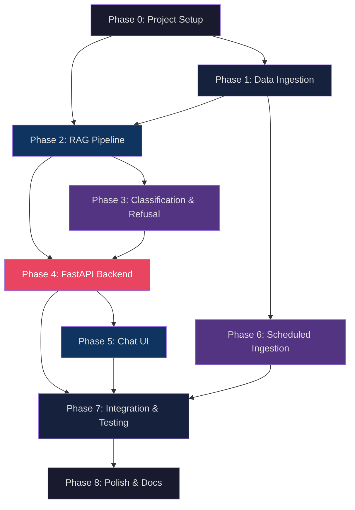

# Implementation Plan — Mutual Fund FAQ Assistant

> **Reference:** [architecture.md](file:///Users/ris/Cursor/RAG%20Chatbot/architecture.md) · [context.md](file:///Users/ris/Cursor/RAG%20Chatbot/context.md)

---

## Phase Overview

| Phase | Name | Focus | Key Deliverables | Est. Effort |
|---|---|---|---|---|
| **0** | Project Setup | Scaffolding, dependencies, config | Directory structure, `.env`, `requirements.txt` | 1–2 hrs |
| **1** | Data Ingestion Pipeline | Scrape → Extract → Chunk → Embed | 15 Groww pages scraped, chunked, and stored in ChromaDB | 3–4 hrs |
| **2** | RAG Core Pipeline | Retrieval + LLM Generation | Working query → retrieve → generate flow | 3–4 hrs |
| **3** | Query Classification & Refusal | Intent detection + refusal handling | Classifier, refusal templates, PII detection | 2–3 hrs |
| **4** | FastAPI Backend | REST API layer | `/api/chat`, `/api/health`, CORS, error handling | 2–3 hrs |
| **5** | Chat UI (Frontend) | Minimal chat interface | Welcome screen, chat flow, citations, disclaimer | 3–4 hrs |
| **6** | Scheduled Ingestion | Automated data refresh | GitHub Actions workflow, cron schedule | 1–2 hrs |
| **7** | Integration & Testing | End-to-end wiring + validation | Full working system, test suite, bug fixes | 3–4 hrs |
| **8** | Polish & Documentation | README, final tweaks | README.md, known limitations, cleanup | 1–2 hrs |

**Total Estimated Effort: 19–26 hours**

---

## Phase 0 — Project Setup & Scaffolding

> **Goal:** Set up the directory structure, install dependencies, configure environment variables.

### Tasks

- [x] Create the project directory structure as per [architecture.md §4](file:///Users/ris/Cursor/RAG%20Chatbot/architecture.md):
  ```
  RAG Chatbot/
  ├── backend/
  │   ├── main.py
  │   ├── config.py
  │   ├── requirements.txt
  │   ├── .env
  │   ├── api/
  │   │   ├── __init__.py
  │   │   ├── routes.py
  │   │   └── schemas.py
  │   ├── core/
  │   │   ├── __init__.py
  │   │   ├── classifier.py
  │   │   ├── rag_pipeline.py
  │   │   ├── refusal_handler.py
  │   │   └── prompt_templates.py
  │   ├── ingestion/
  │   │   ├── __init__.py
  │   │   ├── scraper.py
  │   │   ├── extractor.py
  │   │   ├── chunker.py
  │   │   ├── embedder.py
  │   │   └── sources.json
  │   └── data/
  │       └── chroma_db/
  ├── frontend/
  │   ├── index.html
  │   ├── style.css
  │   └── script.js
  └── scripts/
      ├── ingest.py
      └── test_queries.py
  ```
- [x] Create `requirements.txt` with all dependencies:
  ```
  fastapi
  uvicorn[standard]
  requests
  beautifulsoup4
  chromadb
  langchain
  langchain-text-splitters
  sentence-transformers
  groq
  python-dotenv
  pydantic
  ```
- [x] Create `.env` file with placeholders:
  ```
  GROQ_API_KEY=your_key_here
  EMBEDDING_MODEL=BAAI/bge-small-en-v1.5
  LLM_MODEL=llama-3.3-70b-versatile    # or mixtral-8x7b-32768
  CHROMA_PERSIST_DIR=./data/chroma_db
  ```
- [x] Create `config.py` to load environment variables using `python-dotenv`
- [x] Create `.gitignore` (exclude `.env`, `chroma_db/`, `__pycache__/`, `*.pyc`)
- [x] Set up Python virtual environment and install dependencies
- [x] Verify all imports work with a quick smoke test

### Exit Criteria
✅ All directories and placeholder files exist  
✅ `pip install -r requirements.txt` succeeds  
✅ `config.py` loads `.env` values correctly

---

## Phase 1 — Data Ingestion Pipeline

> **Goal:** Scrape all 15 Groww scheme pages, extract clean text, chunk it, generate embeddings, and store in ChromaDB.

### Architecture Reference
- [Ingestion pipeline diagram](file:///Users/ris/Cursor/RAG%20Chatbot/architecture.md) — §2.5
- [Ingestion flow (Mermaid)](file:///Users/ris/Cursor/RAG%20Chatbot/architecture.md) — §5.1

### Step 1.1 — Source Configuration (`sources.json`)

- [x] Create `backend/ingestion/sources.json` with all 15 URLs organized by AMC:

| AMC | Schemes | URLs |
|---|---|---|
| Nippon India MF | Small Cap, Large Cap, Multi Cap | 3 |
| Motilal Oswal MF | Midcap 30, Long Term, Multicap 35 | 3 |
| Mirae Asset MF | Large & Midcap, Flexi Cap, Healthcare | 3 |
| ABSL MF | Gold, Enhanced Arbitrage, Multi-Asset Allocation | 3 |
| ICICI Prudential MF | Silver ETF FoF, Liquid, Balanced Advantage | 3 |

### Step 1.2 — Web Scraper (`scraper.py`)

- [x] Implement `scrape_url(url: str) -> str` function:
  - Use `requests.get()` with proper headers (User-Agent)
  - Handle HTTP errors (timeout, 4xx, 5xx) gracefully
  - Return raw HTML content
- [x] Implement `scrape_all_sources(sources_path: str) -> list[dict]`:
  - Load URLs from `sources.json`
  - Scrape each URL with retry logic (max 2 retries)
  - Log success/failure per URL
  - Return list of `{ url, html, scheme_name, amc, category, scraped_date }`
- [x] Add rate limiting (1-second delay between requests) to avoid blocking

### Step 1.3 — Text Extractor (`extractor.py`)

- [x] Implement `extract_text(html: str) -> str`:
  - Parse HTML with BeautifulSoup
  - Extract relevant sections from Groww scheme pages:
    - Fund name and basic info
    - NAV, AUM, expense ratio
    - Exit load, minimum investment details, lock-in periods
    - Risk category, benchmark
    - Fund manager information
    - Scheme category and type
    - Process to download statements or capital gains reports
  - Remove navigation, ads, scripts, footers
  - Normalize whitespace, fix encoding issues
- [x] Implement `clean_text(raw_text: str) -> str`:
  - Remove duplicate whitespace
  - Strip HTML entities
  - Normalize unicode characters

### Step 1.4 — Document Chunker (`chunker.py`)

- [x] Implement chunking using LangChain's `RecursiveCharacterTextSplitter`:
  ```python
  chunk_size = 1500      # characters (approx 350-400 tokens)
  chunk_overlap = 200    # characters
  separators = ["\n\n", "\n", ". ", " "]
  ```
- [x] Attach metadata to each chunk:
  ```json
  {
    "chunk_id": "nippon_india_small_cap_chunk_003",
    "source_url": "https://groww.in/mutual-funds/...",
    "source_title": "Nippon India Small Cap Fund — Groww",
    "scheme_name": "Nippon India Small Cap Fund",
    "category": "Small Cap",
    "amc": "Nippon India Mutual Fund",
    "scraped_date": "2026-07-03",
    "chunk_index": 3,
    "total_chunks": 8
  }
  ```

### Step 1.5 — Embedder & Indexer (`embedder.py`)

- [x] Initialize BGE embedding model (`BAAI/bge-large-en-v1.5` via sentence-transformers)
- [x] Implement `embed_and_store(chunks: list, metadata: list)`:
  - Generate embeddings for all chunks (batch processing)
  - Store in ChromaDB with metadata
  - Use persistent storage (`CHROMA_PERSIST_DIR`)
- [x] Add collection name: `"mutual_fund_facts"`
- [x] Log total chunks stored and time taken

### Step 1.6 — Ingestion Runner (`scripts/ingest.py`)

- [x] Wire all ingestion steps together:
  1. Load `sources.json`
  2. Scrape all 15 URLs
  3. Extract and clean text
  4. Chunk documents
  5. Embed and store in ChromaDB
- [x] Add CLI progress output (e.g., "Scraping 3/15: Nippon India Multi Cap Fund...")
- [x] Print summary: total URLs scraped, total chunks created, time elapsed

### Exit Criteria
✅ `python scripts/ingest.py` runs end-to-end without errors  
✅ ChromaDB contains indexed chunks from all 15 Groww pages  
✅ Each chunk has correct metadata (URL, scheme name, AMC, category, date)  
✅ Console logs show progress and final summary

---

## Phase 2 — RAG Core Pipeline

> **Goal:** Build the retrieval + generation pipeline that takes a user query and returns a factual answer with citation.

### Architecture Reference
- [RAG pipeline diagram](file:///Users/ris/Cursor/RAG%20Chatbot/architecture.md) — §2.4
- [Prompt engineering](file:///Users/ris/Cursor/RAG%20Chatbot/architecture.md) — §2.6

### Step 2.1 — Prompt Templates (`prompt_templates.py`)

- [ ] Define the **system prompt**:
  ```
  You are a facts-only mutual fund FAQ assistant. You answer questions about
  mutual fund schemes using ONLY the provided context from official sources.

  STRICT RULES:
  1. Answer in a MAXIMUM of 3 sentences.
  2. Use ONLY information present in the provided context.
  3. NEVER give investment advice, opinions, or recommendations.
  4. NEVER compare fund performances or calculate returns.
  5. If the context does not contain the answer, say:
     "I don't have this information in my current sources."
  6. ALWAYS cite the source — the citation will be attached separately.

  RESPONSE FORMAT:
  - Direct, factual answer (1–3 sentences max)
  - Do NOT include phrases like "Based on the document" or "According to"
  - Use plain, simple language
  ```
- [ ] Define the **user prompt template**:
  ```
  CONTEXT (from official sources):
  {retrieved_chunks}

  USER QUESTION: {user_query}

  Provide a factual answer following the rules above.
  ```

### Step 2.2 — RAG Pipeline (`rag_pipeline.py`)

- [ ] Implement `retrieve_context(query: str) -> list[dict]`:
  - Load the embedding model using `SentenceTransformer(settings.EMBEDDING_MODEL)`
  - Connect to ChromaDB at `settings.CHROMA_PERSIST_DIR` and get the `"mutual_fund_facts"` collection
  - Embed user query
  - Query ChromaDB collection (`collection.query()`) for top-k = 5 similar chunks
  - Filter by minimum similarity threshold (if applicable to distance metrics)
  - Rerank and select top 3 most relevant chunks
  - Return chunks with their associated metadata (`source_url`, `source_title`, `scraped_date`, etc.)

- [ ] Implement `generate_answer(query: str, context_chunks: list) -> dict`:
  - Construct full prompt from system + context + query
  - Call Groq API (e.g., `llama-3.3-70b-versatile`) using the `groq` Python client
  - Parse response
  - Extract citation from the most relevant chunk's metadata (`url` from `source_url`, `title` from `source_title`)
  - Extract `last_updated` from the chunk's `scraped_date` metadata
  - Build response object:
    ```json
    {
      "answer": "...",
      "citation": { "url": "https://...", "title": "Scheme Name — Groww" },
      "last_updated": "2026-07-03",
      "type": "factual"
    }
    ```

- [ ] Implement `handle_no_context()` fallback:
  - Returns: "I don't have this information in my current sources."
  - type: `"no_match"`

### Step 2.3 — Standalone RAG Test

- [ ] Create a quick test script to validate the pipeline end-to-end:
  ```python
  query = "What is the expense ratio of Nippon India Small Cap Fund?"
  result = rag_pipeline.process_query(query)
  print(result)
  ```
- [ ] Test with 5+ factual queries to confirm retrieval quality
- [ ] Tune `top_k`, `similarity_threshold`, and `chunk_size` if needed

### Exit Criteria
✅ `process_query("What is the expense ratio of Nippon India Small Cap Fund?")` returns a correct, cited answer  
✅ Queries with no matching context return the fallback message  
✅ Response format matches the schema (answer + citation + last_updated + type)  
✅ LLM responses are ≤ 3 sentences

---

## Phase 3 — Query Classification & Refusal Handling

> **Goal:** Detect advisory/out-of-scope queries and return polite refusal responses. Implement PII detection.

### Architecture Reference
- [Query classifier](file:///Users/ris/Cursor/RAG%20Chatbot/architecture.md) — §2.3
- [Refusal handler](file:///Users/ris/Cursor/RAG%20Chatbot/architecture.md) — §2.7
- [PII detection](file:///Users/ris/Cursor/RAG%20Chatbot/architecture.md) — §6

### Step 3.1 — Query Classifier (`classifier.py`)

- [ ] Implement `classify_query(query: str) -> str` returning one of:
  - `"FACTUAL"` — proceed to RAG pipeline
  - `"ADVISORY"` — "Should I invest?", "Which is better?", recommendations
  - `"OUT_OF_SCOPE"` — stocks, crypto, banking, unrelated topics
  - `"PII_DETECTED"` — query contains PAN, Aadhaar, phone, email

- [ ] **Strategy for Rate Limits:** Given the strict Groq limits (30 RPM, 12K TPM for `llama-3.3-70b-versatile`), we must minimize API calls. 
  - Option A: Use a smaller, faster model (e.g., `llama-3.1-8b-instant`) specifically for classification, which has separate and higher rate limits.
  - Option B: Combine classification and generation into a single prompt to halve the number of requests per query. 
  - *Decision:* We will implement a lightweight LLM call using `llama-3.1-8b-instant` for classification to preserve the 70B model's RPM for actual generation.

- [ ] System prompt for classifier (using `llama-3.1-8b-instant`):
  ```
  Classify the following user query into one of these categories:
  - FACTUAL: Questions about fund details (expense ratio, NAV, exit load, SIP, etc.)
  - ADVISORY: Questions asking for investment advice, recommendations, or comparisons
  - OUT_OF_SCOPE: Questions unrelated to mutual funds
  
  Respond with ONLY the category name.
  ```

### Step 3.2 — PII Detection (Pre-Classifier)

- [ ] Implement `detect_pii(query: str) -> bool` using regex patterns:

  | PII Type | Pattern | Action |
  |---|---|---|
  | PAN | `[A-Z]{5}[0-9]{4}[A-Z]{1}` | Block |
  | Aadhaar | `[0-9]{4}\s?[0-9]{4}\s?[0-9]{4}` | Block |
  | Phone | `(\+91)?[6-9][0-9]{9}` | Strip |
  | Email | `[\w.%+-]+@[\w.-]+\.[a-zA-Z]{2,}` | Strip |

- [ ] PII check runs **before** the classifier (no PII ever reaches the LLM)
- [ ] Return a user-friendly warning: "Please avoid sharing personal information like PAN, Aadhaar, or phone numbers."

### Step 3.3 — Refusal Handler (`refusal_handler.py`)

- [ ] Implement `get_refusal_response(category: str) -> dict`:

  | Category | Response | Educational Link |
  |---|---|---|
  | `ADVISORY` | "I can only provide factual information..." | AMFI Knowledge Center |
  | `COMPARISON` | "I'm not able to compare fund performances..." | Scheme factsheet link |
  | `OUT_OF_SCOPE` | "This question is outside my scope..." | AMFI India homepage |
  | `PII_DETECTED` | "Please avoid sharing personal information..." | — |

- [ ] Response format matches the standard schema:
  ```json
  {
    "answer": "...",
    "citation": { "url": "...", "title": "..." },
    "last_updated": null,
    "type": "refusal"
  }
  ```

### Step 3.4 — Integration

- [ ] Wire classifier + PII detection + refusal handler into the main query flow:
  ```
  Query → PII Check → Classify → FACTUAL → RAG Pipeline
                                → ADVISORY → Refusal Handler
                                → OUT_OF_SCOPE → Refusal Handler
  ```

### Exit Criteria
✅ "Should I invest in this fund?" → polite refusal with AMFI link  
✅ "What is Bitcoin?" → out-of-scope refusal  
✅ "My PAN is ABCDE1234F" → PII warning  
✅ "What is the expense ratio of X fund?" → passes to RAG pipeline  
✅ No PII ever reaches the LLM

---

## Phase 4 — FastAPI Backend

> **Goal:** Expose the RAG pipeline and classification logic via a REST API.

### Architecture Reference
- [API layer](file:///Users/ris/Cursor/RAG%20Chatbot/architecture.md) — §2.2
- [Error handling](file:///Users/ris/Cursor/RAG%20Chatbot/architecture.md) — §7

### Step 4.1 — Pydantic Schemas (`api/schemas.py`)

- [x] Define request/response models:
  ```python
  class ChatRequest(BaseModel):
      query: str = Field(..., min_length=1, max_length=500)

  class Citation(BaseModel):
      url: str
      title: str

  class ChatResponse(BaseModel):
      answer: str
      citation: Optional[Citation]
      last_updated: Optional[str]
      type: Literal["factual", "refusal", "no_match", "error"]
  ```

### Step 4.2 — API Routes (`api/routes.py`)

- [x] `POST /api/chat`:
  1. Validate input (length, non-empty)
  2. Run PII detection
  3. Classify query
  4. Route to RAG pipeline or refusal handler
  5. Return structured `ChatResponse`
  
- [x] `GET /api/health`:
  - Check ChromaDB collection exists and has documents
  - Return `{ "status": "ok", "documents": N }`

### Step 4.3 — FastAPI App (`main.py`)

- [x] Initialize FastAPI app with metadata (title, description, version)
- [x] Add CORS middleware (allow frontend origin)
- [x] Include API router
- [x] Add startup event to verify ChromaDB is populated
- [x] Add global exception handler for unhandled errors

### Step 4.4 — Error Handling

- [x] Implement error handling per [architecture.md §7](file:///Users/ris/Cursor/RAG%20Chatbot/architecture.md):

  | Scenario | Handling |
  |---|---|
  | LLM API timeout | Retry once → friendly error |
  | Empty query | 400 Bad Request |
  | Query too long (>500 chars) | 400 Bad Request |
  | Internal error | 500 with generic message |

### Step 4.5 — Backend Smoke Test

- [x] Start server: `uvicorn main:app --reload --port 8000`
- [x] Test with `curl`:
  ```bash
  # Health check
  curl http://localhost:8000/api/health

  # Factual query
  curl -X POST http://localhost:8000/api/chat \
    -H "Content-Type: application/json" \
    -d '{"query": "What is the expense ratio of Nippon India Small Cap Fund?"}'

  # Advisory query (should be refused)
  curl -X POST http://localhost:8000/api/chat \
    -H "Content-Type: application/json" \
    -d '{"query": "Should I invest in this fund?"}'
  ```

### Exit Criteria
✅ `GET /api/health` returns `200 OK` with document count  
✅ `POST /api/chat` with factual query returns correct answer + citation  
✅ `POST /api/chat` with advisory query returns refusal  
✅ Invalid inputs return proper 400 errors  
✅ Server handles errors gracefully without crashing

---

## Phase 5 — Chat UI (Frontend)

> **Goal:** Build a minimal, clean chat interface with welcome message, example questions, and disclaimer.

### Architecture Reference
- [UI layer](file:///Users/ris/Cursor/RAG%20Chatbot/architecture.md) — §2.1

### Step 5.1 — HTML Structure (`index.html`)

- [x] Create the page layout:
  - Header with app title: "Mutual Fund FAQ Assistant"
  - Disclaimer banner: `"Facts-only. No investment advice."`
  - Chat container (scrollable message area)
  - Input area (text input + send button)
- [x] Add welcome message card:
  - Greeting text explaining the assistant's capabilities
  - Three clickable example questions:
    1. "What is the expense ratio of Nippon India Small Cap Fund?"
    2. "What is the exit load for ICICI Prudential Balanced Advantage Fund?"
    3. "What is the minimum SIP amount for Mirae Asset Flexi Cap Fund?"
- [x] Add semantic HTML and meta tags for accessibility

### Step 5.2 — Styling (`style.css`)

- [x] Design system:
  - Clean, modern typography (Google Fonts — Inter or similar)
  - Light theme with subtle colors
  - Card-based chat bubbles (user vs. assistant)
- [x] Components:
  - Welcome card with gradient header
  - Example question buttons (clickable chips)
  - User message bubble (right-aligned, colored)
  - Assistant message bubble (left-aligned, white/light)
  - Citation link styled distinctly
  - "Last updated" footer in muted text
  - Loading spinner/animation
  - Disclaimer banner (fixed or prominent)
- [x] Responsive layout (mobile-friendly)

### Step 5.3 — JavaScript Logic (`script.js`)

- [x] Implement chat flow:
  1. User types query or clicks example question
  2. Display user message in chat
  3. Show loading indicator
  4. Send `POST /api/chat` with query
  5. Receive response
  6. Display assistant message with:
     - Answer text
     - Citation link (clickable)
     - "Last updated from sources: \<date\>" footer
  7. Handle refusal responses (different styling)
  8. Handle errors gracefully (show retry message)
- [x] Implement example question click handlers
- [x] Auto-scroll to latest message
- [x] Disable send button while loading
- [x] Handle Enter key to send
- [x] Input validation (non-empty, max length)

### Exit Criteria
✅ Welcome screen renders with 3 example questions  
✅ Clicking an example question sends it as a query  
✅ User messages appear on the right, assistant on the left  
✅ Citation links are clickable and open in new tab  
✅ "Last updated" footer appears on every factual response  
✅ Loading spinner shows while waiting for response  
✅ Disclaimer banner is always visible  
✅ UI is responsive on mobile

---

## Phase 6 — Scheduled Ingestion

> **Goal:** Automate the data ingestion pipeline using GitHub Actions to periodically update ChromaDB with fresh mutual fund data.

### Step 6.1 — GitHub Actions Workflow (`.github/workflows/ingestion.yml`)

- [x] Create `.github/workflows/ingestion.yml` file
- [x] Configure `cron` schedule (e.g., `0 5 * * *` for daily at 10:30 AM IST)
- [x] Add `workflow_dispatch` for manual triggering
- [x] Set up job to run on `ubuntu-latest`
- [x] Configure Python environment and install dependencies from `requirements.txt`
- [x] Ensure secrets (e.g., `GROQ_API_KEY`) are set in GitHub repository settings

### Step 6.2 — Workflow Execution

- [x] Add step to run `python scripts/ingest.py`
- [x] Add step to commit and push the updated `data/chroma_db/` back to the repository
- [x] Configure Git user (e.g., `github-actions[bot]`) for the commit

### Exit Criteria
✅ `.github/workflows/ingestion.yml` is created  
✅ Workflow runs successfully manually and on schedule  
✅ Updated ChromaDB data is successfully committed back to the repo  

---

## Phase 7 — Integration & Testing

> **Goal:** Wire everything together end-to-end and run comprehensive tests.

### Architecture Reference
- [Testing strategy](file:///Users/ris/Cursor/RAG%20Chatbot/architecture.md) — §9

### Step 7.1 — End-to-End Integration

- [x] Start backend: `uvicorn main:app --port 8000`
- [x] Serve frontend: open `index.html` via Live Server (port 5500)
- [x] Verify CORS works between frontend and backend
- [x] Test the full flow: type query → loading → response → citation

### Step 7.2 — Create Test Suite (`scripts/test_queries.py`)

- [x] **Factual accuracy tests** (should return correct answers):
  ```
  "What is the expense ratio of Nippon India Small Cap Fund?"
  "What is the exit load for ICICI Prudential Balanced Advantage Fund?"
  "What is the minimum SIP amount for Mirae Asset Flexi Cap Fund?"
  "What is the benchmark index for Nippon India Large Cap Fund?"
  "What category does ABSL Gold Fund belong to?"
  "What is the NAV of Motilal Oswal Midcap 30 Fund?"
  "What is the risk level of ICICI Prudential Liquid Fund?"
  "Who is the fund manager of Mirae Asset Healthcare Fund?"
  ```

- [x] **Refusal tests** (should return polite refusal):
  ```
  "Should I invest in Nippon India Small Cap Fund?"
  "Which fund is better — ICICI Liquid or ABSL Gold?"
  "Is this fund good for long term?"
  "Recommend a mutual fund for me"
  "Will this fund give 20% returns?"
  ```

- [x] **Out-of-scope tests** (should refuse):
  ```
  "What is the price of Reliance stock?"
  "How do I open a bank account?"
  "What is Bitcoin?"
  "Tell me a joke"
  ```

- [x] **PII tests** (should block):
  ```
  "My PAN is ABCDE1234F, what is the exit load?"
  "My Aadhaar is 1234 5678 9012"
  "Call me at 9876543210"
  "Email me at user@example.com"
  ```

- [x] **Edge case tests**:
  ```
  "" (empty query)
  "a" (single character)
  "asdfghjkl" (gibberish)
  Very long query (>500 chars)
  Query with special characters
  ```

### Step 7.3 — Validation Checklist

- [x] Every factual response has ≤ 3 sentences
- [x] Every factual response has exactly 1 citation link
- [x] Every factual response has a "Last updated from sources: \<date\>" footer
- [x] Citation URLs are valid Groww links
- [x] Refusal responses include educational links
- [x] PII never reaches the LLM
- [x] UI handles all response types correctly (factual, refusal, error)

### Step 7.4 — Bug Fixes

- [x] Fix any issues found during testing
- [x] Tune similarity threshold if retrieval quality is poor
- [x] Adjust chunk size/overlap if context is too fragmented
- [x] Refine system prompt if LLM responses are too verbose or miss constraints

### Exit Criteria
✅ All factual test queries return correct, cited answers  
✅ All advisory/out-of-scope queries are properly refused  
✅ All PII patterns are detected and blocked  
✅ UI renders all response types correctly  
✅ No crashes or unhandled errors  
✅ Response latency < 3 seconds for most queries

---

## Phase 8 — Polish & Documentation

> **Goal:** Write README, add final touches, and prepare for delivery.

### Step 8.1 — README.md

- [x] Write comprehensive README with:
  - **Project title and description**
  - **Selected AMCs and schemes** (table of all 15)
  - **Architecture overview** (simplified diagram or link to `architecture.md`)
  - **Tech stack** (Python, FastAPI, ChromaDB, Groq, BGE, etc.)
  - **Setup instructions**:
    1. Clone repository
    2. Create virtual environment
    3. Install dependencies
    4. Add API keys to `.env`
    5. Run ingestion: `python scripts/ingest.py`
    6. Start backend: `uvicorn backend.main:app --port 8000`
    7. Open frontend: `frontend/index.html`
  - **Usage** — example queries and expected behavior
  - **Known limitations**
  - **Disclaimer snippet**

### Step 8.2 — Known Limitations

- [x] Document these in README:
  - Data is scraped from Groww pages at a point in time; may become stale
  - Only 15 schemes from 5 AMCs are covered
  - No real-time NAV updates
  - No multi-turn conversation memory
  - English only
  - Dependent on LLM API availability

### Step 8.3 — Final Cleanup

- [x] Remove any debug `print()` statements
- [x] Ensure `.env` is in `.gitignore`
- [x] Verify no API keys are hardcoded
- [x] Add inline code comments where logic is non-obvious
- [x] Format code consistently (run `black` or similar)

### Step 8.4 — Final Verification

- [x] Fresh setup test:
  1. Delete `chroma_db/` directory
  2. Run `python scripts/ingest.py`
  3. Start backend
  4. Open frontend
  5. Test 3 factual queries, 2 refusal queries, 1 PII query
- [x] Confirm everything works from scratch

### Exit Criteria
✅ README.md is complete with setup instructions  
✅ A new user can set up and run the project from scratch  
✅ No API keys or sensitive data in codebase  
✅ Code is clean and well-commented  
✅ All success criteria from [context.md §7](file:///Users/ris/Cursor/RAG%20Chatbot/context.md) are met

---

## Dependency Graph



### Critical Path

```
Phase 0 → Phase 1 → Phase 2 → Phase 3 → Phase 4 → Phase 7 → Phase 8
               ↘                                ↗
                 Phase 6 ───────────────────────
                                                ↗
                                     Phase 5 ──┘
```

> **Phase 5 (Frontend)** can be developed in parallel with Phase 3 & 4 since it's independent of backend logic until integration.

---

## Risk & Mitigation

| Risk | Impact | Mitigation |
|---|---|---|
| Groww pages use heavy JavaScript rendering | Scraper gets empty/incomplete HTML | Use `requests` first; fall back to `selenium` or headless browser if needed |
| LLM generates advisory content despite prompt | Compliance violation | Add post-processing validation to filter advisory language |
| Embedding model quality too low | Poor retrieval accuracy | Try multiple models; increase `top_k`; reduce similarity threshold |
| Groww page structure changes | Scraper breaks | Build resilient selectors; add fallback to raw text extraction |
| API rate limits (LLM provider) | Service interruption | Implement exponential backoff + caching for repeat queries |
| ChromaDB storage grows large | Memory issues | 15 URLs will produce ~100-200 chunks — well within limits |
